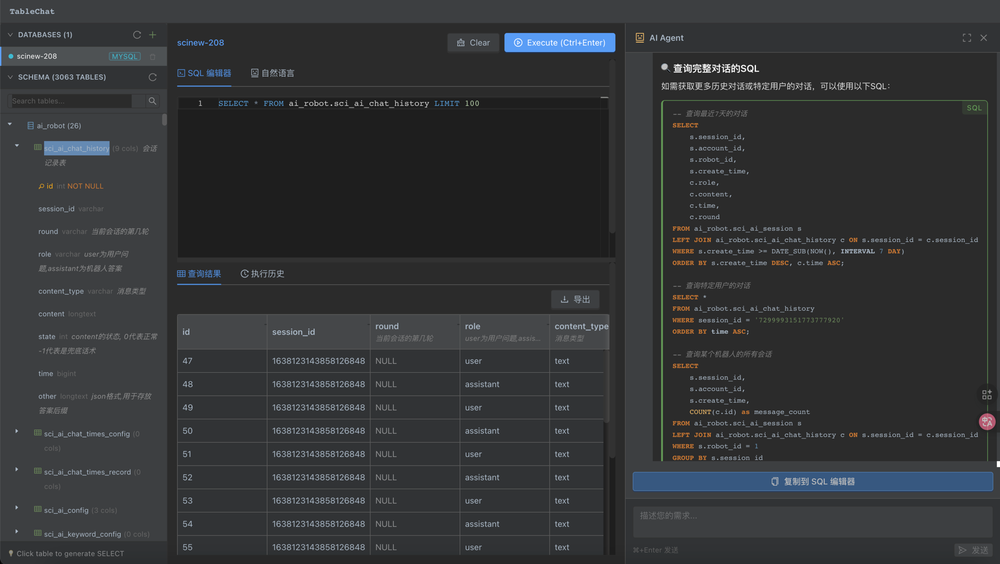
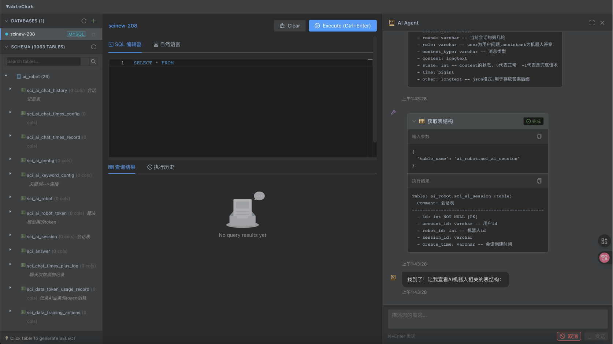

<p align="center">
  
</p>

<h1 align="center">🤖 TableChat</h1>

<p align="center">
  <strong>让 AI 帮你探索数据库、生成 SQL —— 像和专家对话一样简单</strong>
</p>

<p align="center">
  <a href="#-核心亮点">核心亮点</a> •
  <a href="#-快速开始">快速开始</a> •
  <a href="#-功能特性">功能特性</a> •
  <a href="#-技术栈">技术栈</a>
</p>

<p align="center">
  
  
  
</p>

<p align="center">
  
  
  
</p>

---

## ✨ 核心亮点

<table>
<tr>
<td width="50%">

### 🧠 AI Agent 模式

不同于简单的 "文字转SQL"，TableChat 的 **Agent 模式** 让 AI 像一个真正的数据库专家一样工作：

- 🔍 **自主探索** — AI 会主动查看表结构、理解表关系
- 💭 **透明思考** — 实时看到 AI 的推理过程和工具调用
- 🛠️ **智能工具使用** — 列表、查结构、试查询，步步为营
- ✅ **生成任意 SQL** — SELECT、CREATE INDEX、ALTER TABLE 都行

</td>
<td width="50%">

```
👤 用户: 帮我给订单表的用户ID加个索引

🤖 Agent 思考中...
   ├─ 🔧 list_tables → 发现 orders, users, products...
   ├─ 🔧 get_table_schema("orders") → 找到 user_id 字段
   └─ 💡 生成: CREATE INDEX idx_orders_user_id 
              ON orders(user_id);

✅ SQL 已生成，点击复制到编辑器
```

</td>
</tr>
</table>

### 🎯 为什么选择 Agent 模式？

| 普通 AI 查询 | TableChat Agent |
|:---:|:---:|
| 依赖预设的表结构 | **自主探索**数据库 |
| 一次生成，对错看运气 | **边验证边生成**，更准确 |
| 只能 SELECT | **任意 SQL**（DDL/DML） |
| 黑盒输出 | **透明展示**思考过程 |
| 大库容易幻觉 | **3000+ 表**依然精准 |

---

## 🚀 快速开始

**30 秒启动，无需安装 Python/Node 环境！**

```bash
# 1. 克隆项目
git clone https://github.com/your-username/tableChat.git
cd tableChat

# 2. 配置 API Key（Agent 模式需要）
cp .env.example .env
# 编辑 .env，填入你的 Anthropic API Key:
# AGENT_API_KEY=sk-ant-xxxxx

# 3. 一键启动
docker compose up --build -d

# 🎉 完成！
# 前端: http://localhost:5888
# API:  http://localhost:7888/docs
```

<details>
<summary>📋 <b>停止和日志</b></summary>

```bash
# 停止服务
docker compose down

# 查看日志
docker compose logs -f

# 重新构建
docker compose up --build
```

</details>

---

## 🎬 功能演示

### Agent 模式 — 智能探索数据库

<p align="center">
  
</p>

> 💡 AI 自动探索表结构 → 执行验证查询 → 生成精准 SQL → Markdown 格式化输出

### 工具调用 — 透明的思考过程

<p align="center">
  
</p>

> 🔧 可折叠的工具调用块，显示 `list_tables` → `get_table_schema` → `query_database` 完整链路

### 三种查询模式，自由切换

| SQL 编辑器 | 自然语言 | Agent 模式 |
|:---:|:---:|:---:|
| Monaco Editor | 简单场景快速生成 | 复杂场景智能探索 |
| 语法高亮、自动补全 | 两阶段提示链优化 | 实时流式输出 |
| Ctrl+Enter 执行 | 支持大型数据库 | 可折叠工具调用 |

---

## 🔥 功能特性

<table>
<tr>
<td valign="top" width="50%">

### 🤖 AI 能力

- **Agent 模式** — Claude 驱动的智能代理
  - 实时流式输出思考过程
  - 可折叠的工具调用详情
  - 一键复制 SQL 到编辑器
- **自然语言查询** — 简单场景快速生成
  - 两阶段提示链，支持 3000+ 表
  - 智能识别导出意图

### 🗄️ 数据库支持

- PostgreSQL / MySQL 双支持
- 添加、编辑、删除连接
- 密码自动脱敏显示
- SSL 可选配置

</td>
<td valign="top" width="50%">

### 📝 SQL 编辑器

- Monaco Editor 语法高亮
- 快捷键 Ctrl+Enter 执行
- 安全限制仅 SELECT
- 自动 LIMIT 1000

### 📊 结果 & 导出

- 表格展示 + 分页排序
- 导出 CSV / JSON / XLSX
- 执行历史 + 中文全文搜索

### 🔍 Schema 浏览器

- 快速搜索过滤表名
- 表/字段注释显示
- 双击生成 SELECT

</td>
</tr>
</table>

---

## ⚙️ 环境变量

### Agent 模式配置（推荐）

| 变量 | 说明 | 示例 |
|------|------|------|
| `AGENT_API_KEY` | Anthropic API Key（必填） | `sk-ant-api03-xxxxx` |
| `AGENT_API_BASE` | API 地址（可选） | `https://api.anthropic.com` |
| `AGENT_MODEL` | 使用的模型 | `claude-sonnet-4-5-20250929` |

### 自然语言模式配置（可选）

| 变量 | 说明 | 默认值 |
|------|------|--------|
| `LLM_API_KEY` | OpenAI 兼容 API Key | - |
| `LLM_API_BASE` | API 地址 | `https://api.openai.com/v1` |
| `LLM_MODEL` | 模型名称 | `gpt-3.5-turbo` |

---

## 🛠️ 技术栈

<table>
<tr>
<td align="center" width="33%">
<h3>🐍 后端</h3>
Python 3.13 + FastAPI<br/>
Anthropic SDK<br/>
asyncpg / aiomysql<br/>
SQLite + FTS5
</td>
<td align="center" width="33%">
<h3>⚛️ 前端</h3>
React 19 + TypeScript<br/>
Ant Design 5<br/>
Monaco Editor<br/>
Refine 5
</td>
<td align="center" width="33%">
<h3>🐳 部署</h3>
Docker Compose<br/>
Nginx<br/>
Health Check<br/>
Volume 持久化
</td>
</tr>
</table>

---

## 📁 项目结构

```
tableChat/
├── backend/                 # Python 后端
│   ├── app/
│   │   ├── api/v1/         # API 路由 (含 agent 端点)
│   │   ├── services/       # 业务逻辑 (agent_service, agent_tools)
│   │   ├── connectors/     # 数据库连接器
│   │   └── models/         # Pydantic 模型
│   └── Dockerfile
├── frontend/               # React 前端
│   ├── src/
│   │   ├── components/
│   │   │   ├── agent/     # 🤖 Agent 模式组件
│   │   │   ├── editor/    # SQL 编辑器
│   │   │   └── ...
│   │   └── pages/
│   └── Dockerfile
└── docker-compose.yml      # 一键部署
```

---

## 🗺️ Roadmap

- [x] 🤖 Agent 模式 (Claude)
- [x] 💬 自然语言查询
- [x] 🗄️ PostgreSQL + MySQL
- [x] 📊 多格式导出
- [x] 📜 执行历史 + 中文搜索
- [ ] 🔐 SSH 隧道支持
- [ ] 📝 查询收藏
- [ ] 👥 多用户支持

---

## 📄 License

MIT License

---

<p align="center">
  <strong>⭐ 如果觉得有用，请给个 Star ⭐</strong>
</p>

<p align="center">
  Made with ❤️ by the TableChat Team
</p>
