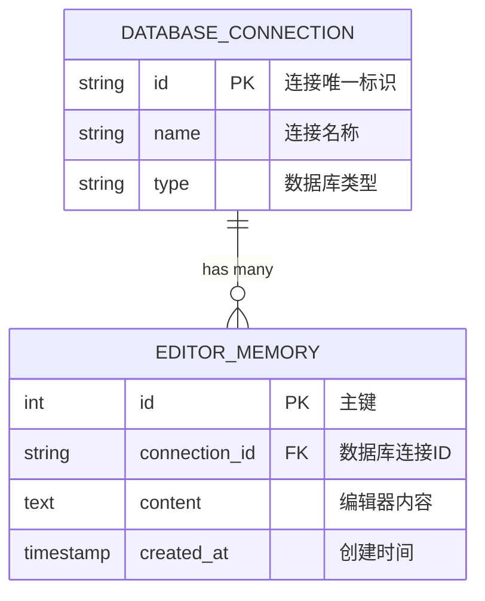

# Data Model: SQL编辑器历史记录功能

**Feature**: 022-sql-editor-memory
**Date**: 2026-01-10

## 实体关系



## 数据库表结构

### editor_memory 表

**用途**: 存储SQL编辑器的历史内容

| 列名 | 类型 | 约束 | 说明 |
|------|------|------|------|
| id | INTEGER | PRIMARY KEY AUTOINCREMENT | 自增主键 |
| connection_id | TEXT | NOT NULL | 数据库连接ID |
| content | TEXT | NOT NULL | 编辑器内容（可为空字符串） |
| created_at | TIMESTAMP | NOT NULL | 创建时间 |

**索引**:
```sql
CREATE INDEX idx_connection_id ON editor_memory(connection_id);
CREATE INDEX idx_created_at ON editor_memory(created_at);
```

**DDL**:
```sql
CREATE TABLE IF NOT EXISTS editor_memory (
    id INTEGER PRIMARY KEY AUTOINCREMENT,
    connection_id TEXT NOT NULL,
    content TEXT NOT NULL,
    created_at TIMESTAMP NOT NULL
);

CREATE INDEX IF NOT EXISTS idx_connection_id ON editor_memory(connection_id);
CREATE INDEX IF NOT EXISTS idx_created_at ON editor_memory(created_at);
```

## 后端数据模型 (Pydantic)

### EditorMemory (响应模型)

```python
from datetime import datetime
from pydantic import BaseModel, Field
from humps import camelize


def to_camel(string: str) -> str:
    """将snake_case转换为camelCase"""
    return camelize(string)


class EditorMemory(BaseModel):
    """SQL编辑器记忆响应模型"""
    id: int = Field(..., description="记录ID")
    connection_id: str = Field(..., description="数据库连接ID")
    content: str = Field(..., description="编辑器内容")
    created_at: datetime = Field(..., description="创建时间")

    class Config:
        alias_generator = to_camel
        populate_by_name = True
        json_schema_extra = {
            "example": {
                "id": 1,
                "connectionId": "conn_123",
                "content": "SELECT * FROM users;",
                "createdAt": "2026-01-10T12:00:00Z"
            }
        }
```

### EditorMemoryCreate (请求模型)

```python
class EditorMemoryCreate(BaseModel):
    """创建SQL编辑器记忆请求模型"""
    connection_id: str = Field(..., description="数据库连接ID", min_length=1)
    content: str = Field(..., description="编辑器内容（可为空字符串）")

    class Config:
        alias_generator = to_camel
        populate_by_name = True
        json_schema_extra = {
            "example": {
                "connectionId": "conn_123",
                "content": "SELECT * FROM users;"
            }
        }
```

### EditorMemoryList (列表响应)

```python
class EditorMemoryList(BaseModel):
    """SQL编辑器记忆列表响应"""
    items: list[EditorMemory] = Field(..., description="记忆列表")
    total: int = Field(..., description="总数")

    class Config:
        alias_generator = to_camel
        populate_by_name = True
```

## 前端数据模型 (TypeScript)

### EditorMemory 接口

```typescript
/**
 * SQL编辑器记忆
 */
export interface EditorMemory {
  /** 记录ID */
  id: number;

  /** 数据库连接ID */
  connectionId: string;

  /** 编辑器内容 */
  content: string;

  /** 创建时间 */
  createdAt: string; // ISO 8601 格式
}
```

### EditorMemoryCreate 接口

```typescript
/**
 * 创建SQL编辑器记忆请求
 */
export interface EditorMemoryCreate {
  /** 数据库连接ID */
  connectionId: string;

  /** 编辑器内容 */
  content: string;
}
```

### EditorMemoryList 接口

```typescript
/**
 * SQL编辑器记忆列表响应
 */
export interface EditorMemoryList {
  /** 记忆列表 */
  items: EditorMemory[];

  /** 总数 */
  total: number;
}
```

## 数据验证规则

### 后端验证 (Pydantic)

1. **connection_id**:
   - 必填
   - 最小长度: 1
   - 类型: 字符串

2. **content**:
   - 必填（可为空字符串）
   - 类型: 字符串
   - 无最大长度限制（TEXT类型）

3. **created_at**:
   - 自动生成
   - 类型: datetime
   - 格式: ISO 8601

### 前端验证 (TypeScript)

1. **connectionId**:
   - 非空字符串
   - 来自当前连接上下文

2. **content**:
   - 字符串类型
   - 允许空字符串

## 数据生命周期

### 创建
1. 前端定时器触发（每30秒）
2. 检查内容是否有变化
3. 调用API保存新记录
4. 后端创建新记录，自动生成id和created_at

### 查询
1. 前端根据connection_id查询
2. 后端返回该连接的所有历史记录
3. 按created_at倒序排列

### 删除
1. 前端请求删除特定记录（按id）
2. 后端删除对应记录
3. 或删除某个连接的所有记录

### 更新
- **不支持更新操作**
- 每次保存都创建新记录
- 历史记录是追加式的

## 数据迁移

### 初始化脚本

```python
async def init_editor_memory_table(db_path: str) -> None:
    """初始化editor_memory表"""
    async with aiosqlite.connect(db_path) as db:
        await db.execute("""
            CREATE TABLE IF NOT EXISTS editor_memory (
                id INTEGER PRIMARY KEY AUTOINCREMENT,
                connection_id TEXT NOT NULL,
                content TEXT NOT NULL,
                created_at TIMESTAMP NOT NULL
            )
        """)

        await db.execute("""
            CREATE INDEX IF NOT EXISTS idx_connection_id
            ON editor_memory(connection_id)
        """)

        await db.execute("""
            CREATE INDEX IF NOT EXISTS idx_created_at
            ON editor_memory(created_at)
        """)

        await db.commit()
```

## 数据示例

### 保存新记录

**请求**:
```json
POST /api/editor-memory
{
  "connectionId": "conn_postgres_prod",
  "content": "SELECT id, name FROM users WHERE active = true;"
}
```

**响应**:
```json
{
  "id": 42,
  "connectionId": "conn_postgres_prod",
  "content": "SELECT id, name FROM users WHERE active = true;",
  "createdAt": "2026-01-10T15:30:00Z"
}
```

### 查询历史记录

**请求**:
```
GET /api/editor-memory/conn_postgres_prod
```

**响应**:
```json
{
  "items": [
    {
      "id": 42,
      "connectionId": "conn_postgres_prod",
      "content": "SELECT id, name FROM users WHERE active = true;",
      "createdAt": "2026-01-10T15:30:00Z"
    },
    {
      "id": 41,
      "connectionId": "conn_postgres_prod",
      "content": "SELECT * FROM users LIMIT 10;",
      "createdAt": "2026-01-10T15:00:00Z"
    }
  ],
  "total": 2
}
```

### 删除记录

**请求**:
```
DELETE /api/editor-memory/42
```

**响应**:
```json
{
  "success": true,
  "message": "记录已删除"
}
```